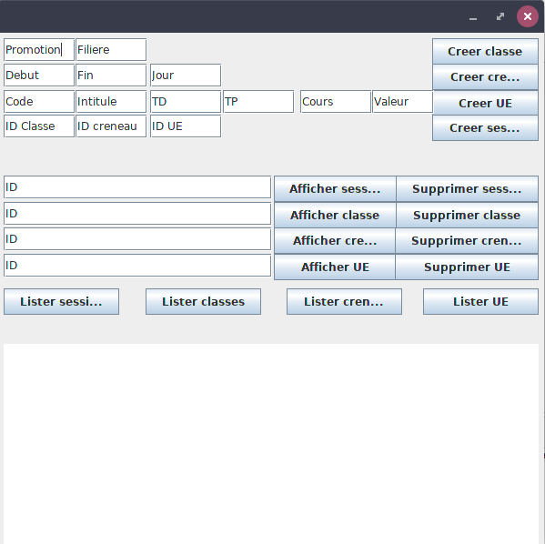

Groupe Session
# Architecture
## Class diagram

## Functional Requirements 
| ID         | Satisfied | Unsatisfied |
|------------|-----------|-------------|
| Req-ses-01 |     X     |             |
| Req-ses-02 |     X     |             |
| Req-ses-03 |     X     |             |
| Req-ses-04 |     X     |             |
| Req-ses-05 |     X     |             |
| Req-ses-06 |     X     |             |
| Req-ses-07 |     X     |             |
| Req-ses-08 |     X     |             |
| Req-ses-09 |           |      X      |
| Req-ses-10 |           |      X      |

- L'utilisateur peut créer une Unité d'Enseignement.
- L'utilisateur peut supprimer une Unité d'Enseignement.
- L'utilisateur peut créer un créneau.
- L'utilisateur peut supprimer un créneau (temporel).
- L'utilisateur peut créer une classe (promo).
- L'utilisateur peut supprimer une classe (promo).
- L'utilisateur peut créer une session (UE – classe - créneau).
- L'utilisateur peut supprimer une session (UE – classe – créneau).
- L'utilisateur peut changer une session de créneau temporel.
- L'utilisateur peut créer des sessions sur un ensemble de créneaux.


## Packages 
- App: App controller
- IHM: User interafce
- Session: implemented methods
- Test: unitary Tests
## Input/output
Input/output of every method is a string of a JSON object .
# Install
This section is for Linux Users
## Technical requirements
- access to internet 
- have sudo privileges
- have eclipse already installed

## Installing java 8
### Check java version
before we begin begin check your java version :
````sh
java --version
# expected 
#openjdk version "1.8.0_162"
````
### Installing java 8
````sh
sudo apt update
sudo apt install openjdk-8-jdk -y
````
### Managing java versions :
````sh
sudo update-alternatives --config java
````

Choose the number associated with the **java-8-openjdk** version to use it as the default, or press ENTER to leave the current settings in place.

# Using release 
## Importing project into eclipse
### Getting and extracting archive
````sh
cd ~
https://github.com/ilyesAj/sessionu/releases/download/0.3.1/eclipse_import.zip
````
### Importing project into workspace via UI 
This section is for all users (Mac Os , Linux , Windows)

1.     Click File -> Import -> from the Eclipse main menu
2.     Expand General, select **Existing Projects into Workspace**, and click Next
3.     Make sure that **Select Archive File is checked** and browse for VectorProducts.zip and browse for the ZIP file
4.     Click Finish 
### Troubleshoot
- verify build path :
make sure that `json-20190722.jar` and `sqlite-jdbc-3.27.2.1.jar` are in referenced libraries as the picture below : 


**otherwise** : 
    1. right-click on the library (`json-20190722.jar` or `sqlite-jdbc-3.27.2.1.jar`) 
    2. click build path -> add to build path 
    if the option doesn't appear click on configure build path and add manually the two jars with `add external JAR` button
- verify Java runtime environments
    1. click window -> preferences
    2. navigate to java ->installed JREs 
    3. verify tha you have the right version of jdk :

**otherwise** : refer to java 8 installation section 
- verifying if the project is using the right jre 

    1.right click on the projet -> properties
    2. choose java Build Path 
    3. you should see jre system library (java8 ..).otherwise click on add library -> jre system library -> choose the right option for your JRE -> finish
## Using Binary
### Executing Binary from eclipse 
right click on src/app/controller.java -> run as -> java application . The expected result is a window like the image below :



### Getting and executing binary from command-line
````sh
cd ~
wget https://github.com/ilyesAj/sessionu/releases/download/0.3.1/executable.jar
sudo chmod +x executable.jar
java -jar executable.jar
````
# Usage 
This section is for all users (Mac Os , Linux , Windows)

default window of the IHM : 


Once we get the binary executed we can : 
 
                • Create a « classe » adding a « promotion » (INT) and « filière » (STRING)
                •  Create « créneau » adding starting and ending hours of the course« début » « fin » (LocalTime) and the day « jour » (LocalDate)
                • Create « une unité d’enseignement » adding « code » and «intitulé» in (STRING) and  « TD, TP, Cours , valeurs »  in ( FLOAT)
                • Create « session » adding « id classe, id créneau , id d’unité d’enseignement » in (STRING)
Example:


We can also
            ▪ Get or delete  « classe, créneau and  EU ».
# Anomalies 
## Non-implemented fonctionality
            ▪ Lister une session
            ▪ Créer des sessions sur un ensemble de créneaux
# delete Project
Right-click on the project -> delete 


